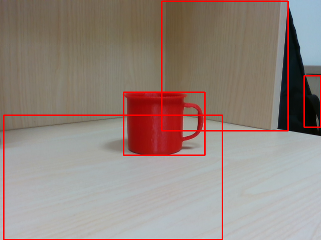
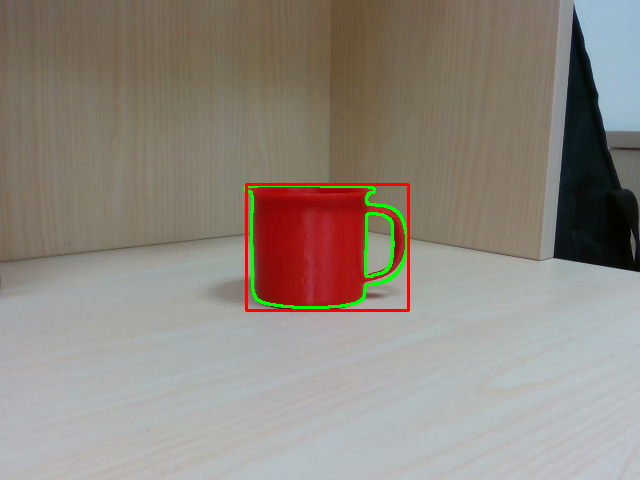
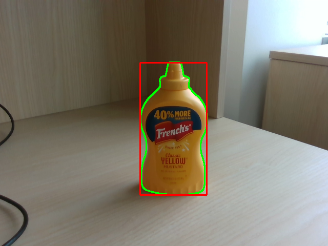
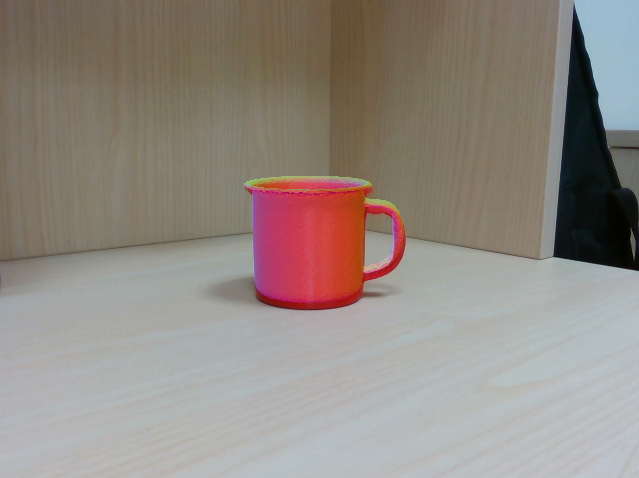

# AGIMUS 2023 Winter School: Perception

The perception course will cover two main areas: (i) object 6D pose estimation from images and (ii) object tracking from videos.
The former is based on [HappyPose](https://github.com/agimus-project/happypose), our open source reimplementation of state-of-the-art object pose estimation methods called CosyPose and MegaPose.
The latter is based on DLR Tracker based on the work of Stoiber et al.

The course is based on following publications:

- Fourmy, M., Priban, V., Behrens, J. K., Mansard, N., Sivic, J., & Petrik, V. (2023). **Visually Guided Model Predictive Robot Control via 6D Object Pose Localization and Tracking**. In review for ICRA 2023. [ArXiv](https://arxiv.org/pdf/2311.05344), [project page](https://data.ciirc.cvut.cz/public/projects/2023VisualMPC/).
- Labbé, Y., Manuelli, L., Mousavian, A., Tyree, S., Birchfield, S., Tremblay, J., Carpentier, J., Aubry, M., Fox, D. and Sivic, J., (2022). **Megapose: 6d pose estimation of novel objects via render & compare**. [ArXiv](https://arxiv.org/abs/2212.06870), [project page](https://megapose6d.github.io/).
- Labbé, Y., Carpentier, J., Aubry, M., & Sivic, J. (2020). **Cosypose: Consistent multi-view multi-object 6d pose estimation**. In ECCV 2020. [ArXiv](https://arxiv.org/abs/2008.08465), [project page](https://www.di.ens.fr/willow/research/cosypose/).
- Stoiber, M., Pfanne, M., Strobl, K. H., Triebel, R., & Albu-Schäffer, A. (2022). SRT3D: A sparse region-based 3D object tracking approach for the real world. International Journal of Computer Vision, 130(4), 1008-1030. [ArXiv](https://arxiv.org/abs/2110.12715)
- Stoiber, M., Sundermeyer, M., & Triebel, R. (2022). Iterative corresponding geometry: Fusing region and depth for highly efficient 3d tracking of textureless objects. In Proceedings of the IEEE/CVF Conference on Computer Vision and Pattern Recognition (pp. 6855-6865). [ArXiv](https://arxiv.org/abs/2203.05334)

## Outline

- Course on perception and tracking
  - 45 mins - Presentation on 6D object pose estimation from images [V. Petrik]
  - 45 mins - Presentation on 6D object pose tracking [M. Fourmy]
- Coding tutorial [V. Petrik, M. Fourmy, K. Zorina, M. Cifka]
  - Object detection in image
  - Object pose estimation for objects known at train time (CosyPose)
  - Object pose estimation for objects unknown at train time (MegaPose)
  - Object pose tracking using DLR tracker
  - Object pose estimation and tracking pipeline

## Installation

It is recommended to use docker, to activate the shell, run (replace variables in capital with your paths):
```
pal_docker.sh --rm --device=/dev/video0:/dev/video0 -v ABS_PATH_TO_YOUR_HAPPYPOSE_DATA_FOLDER:/happypose_data -v $PATH_TO_YOUR_REPO:/school -it reg.saurel.me/aws-2
/opt/miniconda3/bin/conda init && bash
conda activate /aws2
```

### Downloading HappyPose data

Object pose estimators are based on pre-trained networks and the dataset of objects.
To be able to create/run the tutorial code you need to download both with:
```
cd school/perception
export HAPPYPOSE_DATA_DIR=/happypose_data
python -m happypose.toolbox.utils.download --cosypose_models detector-bop-ycbv-pbr--970850  coarse-bop-ycbv-pbr--724183 refiner-bop-ycbv-pbr--604090
python -m happypose.toolbox.utils.download --megapose_models
python -m happypose.toolbox.utils.download --ycbv_compat_models
```

## Tutorial

The tutorial is split into several scripts. In all scripts there are places marked with `TODO` that you need to complete in order for script to work.

### Object Detection

The first practical `01_object_detection.py` will show you how to use object detector on the image.
The detector for YCBV object is loaded and your goal is to filter the detections based on the object ID.
You should see predictions like this:




### Object Pose Estimation (CosyPose)

Practical `02_cosypose.py` shows how to estimate the 6D pose of the object that was known at the train time. The script visualises the projection of the object on the estimated pose into the image:



### Object Pose Estimation (MegaPose)

Practical `03_megapose.py` shows how to use 6D pose estimator for objects unknown at the train time:



### Object pose Tracking
We will now investigate an efficient object pose tracking algorithm, based on the work of Manuel Stoiber.
We wrote [pym3t](https://github.com/MedericFourmy/pym3t), a python wrapper for ease of experimentation around DLR. The  follow installation instructions at .  
:warning: at the time we are writing this tutorial, macOS installation is not supported -> use docker.

### Downloading the tutorial data
TODO: update download link
Download and unzip pre-recorded image sequences from [this link](https://drive.google.com/file/d/1U_M_3kl9UNfTGxRaG7rRlok3fkut_jDA/view?usp=sharing). These sequences were recorded with a RealSense D435, whose intrinsics parameters are provided.
This folders should contains:
- `scene*` folders: contains sequences of `color*.png` and `depth*.png` images
- `cam_d435_640.yaml`: camera intrinsics
- `obj_0000*.obj` files: mesh of object in recorded sequences

#### Object tracking on recorded sequences
This first example loads color (and optionally depth) images recorded with a realsense D435 camera and tracks a single object frame to frame.
The tracker is given a mesh of the object to be tracked and an initial guess of the pose.



When running the tracker on a new object model, a set of template views are rendered, processed and stored in binary files (stored in tmp/ folder). This may take a while but is crucial to the efficiency of the online algorithm.

Run example script:  
`python 04_tracker_image_dir.py --use_region -b obj_000014 -m data -i data/scene1_obj_14 -c data/cam_d435_640_pym3t.yaml -s`

A few experiments starting from here:
- Depth modality: add `--use_depth` option, you should see a slighly faster convergence
- Different scenes: 
  - `scene1_obj_14` and `scene2_obj_14`: work with `-b obj_000014` object 
  - `scene3_obj_05` and `scene4_obj_05`: work with `-b obj_000005` object. Scene4 has bad initial guess, can you make it converge?
- Tikhonov regularization: in this context, has a similar effect to a low-pass filter. Try to crank up or down `scale_t` and
`scale_r` values in the script. You should observe a trade-off between tracking latency and stability.

#### Object tracking from webcam stream
<<<<<<< HEAD
We will now track the YCBV mug (obj_000014) using a webcam video stream. Start the example script, hold your plastic cup so that it matched approximately the render and start tracking by pressing `x`. Press `d` to reinitialize the tracker pose.
=======
We will now track the YCBV mug (obj_000014) using a webcam video stream. Start the script:

`python 05_tracker_webcam.py --use_region -b obj_000014 -m data`  

Press `d` to initialize the object pose, align your cup with the silhouette rendered on the screen and press `x` to start tracking.  

You can again observe the effect of tikhonov regularization on tracking stability and latency. 

Possible experiments:
- Same as `04_tracker_image_dir.py`, except for depth

### Estimate and Track pipeline
>>>>>>> d217fb94295b2e7f357668e040dacd45df128624

`python 05_tracker_webcam.py --use_region -b obj_000014 -m data`  

You can now reproduce the experiments of the previous example (except for the depth input).

#### Bonus
Examine the simplified implementation of the tracking step in `ExecuteTrackingStepSingleObject`, `single_view_tracker.py`/
 
## Contact

In case of any question do not hesitate to contact us:
- Vladimir Petrik, vladimir.petrik@cvut.cz, https://petrikvladimir.github.io/
- Mederic Fourmy, mederic.fourmy@cvut.cz
